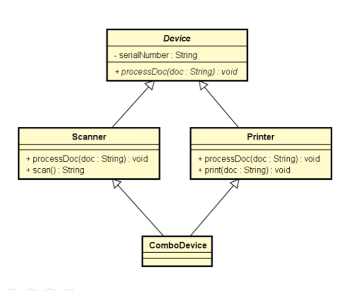

# Aviso
- a partir java 8
  - intefaces podem ter "default methods" ou "defender methods"
- Isso possui implicações conceituais e práticas
- Classicamente não tem implementação de metodos, só que atualmente podem ter

# Interface
- Como se fosse
  - classe abstrada com metodos abstratos
- Estabelece um contrato que uma classe deve cumprir
- Serve pra criar sistemas com baixo acomplamento e flexiveis

# Inversão de controle
- padrão de desenvolvimento que consiste em retirar da classe a responsabilidade de instanciar suas depedências

# Injeção de depencia
- uma forma de realizar inversão de controle
- um componente externo instancia a dependencia que é então injetada no objeto pai
- implementada de várias formas:
  - construtor
  - classe instanciação (builer, factory)
  - Container / framework

# Herdar vs cumprir contrato
- Aspectos com uns
  - relação é um
  - generalização -> especialização
  - polimorfismo

# Diferença
- **Herança** -> reuso
- **Interface** -> contrato a ser cumprido

# Herança multipla e o problema do diamente
- Uma ambiguidade causada pela existência do mesmo método em mais de uma superclasse
- 